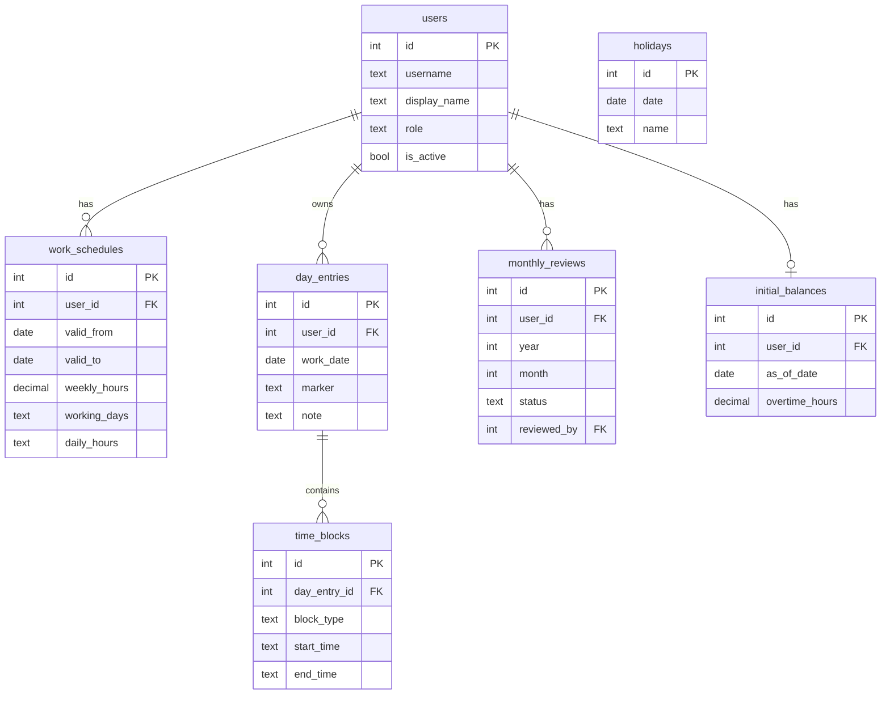

# Spezifikation – Webapp fuer Arbeitszeiterfassung (v2)

## 1. Zielbild

Die bestehende Excel-basierte Zeiterfassung soll als **kleine moderne Webapp** fuer das **lokale Netzwerk** neu umgesetzt werden.
Die Anwendung soll auf einem **kleinen lokalen Server** laufen und von ca. **8 weiteren Rechnern** im LAN genutzt werden koennen.

Wichtige Ziele:

- **einfache, schnelle und intuitive Zeiterfassung**
- **mehrbenutzerfaehig**
- **Rollenmodell mit User und Admin**
- **monatlicher Genehmigungsprozess**
- **klare Trennung der Daten pro Anwender**
- **moderne UI mit Wochenansicht (Excel-nah) und Tagesdetails**
- **geringer Betriebsaufwand**
- **datenschutzfreundlich, lokal betreibbar**

---

## 2. Analyse der bestehenden Excel

### 2.1 Erkannte Struktur

Ein Monatsblatt ("Arbeitszeit 1 quer Hand") mit:

- Kopfbereich: **Monat**, **Mitarbeiter**, **Sollstunden** (z.B. "30Std.")
- Tageszeilen (Mo-Fr) mit Zeitbloecken:
  - **Taetig von / bis**
  - **Vorbereitung von / bis** (Block 1 + Block 2)
  - **DB von / bis** (Dienstbesprechung)
  - **Pause von / bis**
  - **Begruendung** (Freitext: Urlaub, Lichterfest, Ueberstd. Abbau)
- Berechnete Felder: IST-Stunden, SOLL-Stunden, Ueberstunden pro Tag
- Aggregationen: Wochensummen, Monatssummen, Uebertrag

### 2.2 Erkannte Berechnungslogik

IST-Formel pro Tag:
```
IF Begruendung = "Ueberstd. Abbau" THEN IST = SOLL
ELSE IST = ROUND(Summe(alle Arbeitsbloecke) - Summe(Pausen), 2)
```

Ueberstunden-Formel:
```
IF Begruendung = "Ueberstd. Abbau" THEN Ueberstunden = IST * -1
ELSE Ueberstunden = IST - SOLL
```

Monats-Uebertrag: `Ueberstunden_Vormonat + Ueberstunden_Monat`

### 2.3 Erkenntnisse fuer die Webapp

- An Urlaubstagen werden in der Excel trotzdem Arbeitszeiten eingetragen -- der Marker hat keinen Effekt auf die Berechnung. **In der Webapp wird dies verbessert: Urlaub/Krank/Feiertag setzen IST automatisch auf SOLL.**
- SOLL ist statisch 6h/Tag (30h/5 Tage). **Die Webapp unterstuetzt individuelle Stunden pro Wochentag.**
- Nur "Ueberstd. Abbau" hat Sonderlogik. **Die Webapp definiert klare Regeln fuer alle Marker-Typen.**

### 2.4 Schwaechen des Excel-Ansatzes

- keine Mehrbenutzerfaehigkeit
- keine Rechteverwaltung
- keine Auditierung
- Konflikte bei paralleler Nutzung
- Genehmigungen nur umstaendlich
- Formeln teilweise inkonsistent (manche Zeilen ohne Formeln)

---

## 3. Scope

### 3.1 Muss-Anforderungen (MVP)

- Lokale Webapp im LAN
- Mehrbenutzerfaehig mit Rollen (User / Admin)
- Benutzerverwaltung durch Admin
- Sollstundenmodell pro Benutzer (mit Wochentag-Granularitaet)
- Zeiterfassung: Tageseintraege mit 0..n Zeitbloecken
- Tageskennzeichnungen (Urlaub, Krank, Feiertag, Ueberstundenabbau)
- Berechnungen: Tages-IST/SOLL/Delta, Monats-Aggregation, Uebertrag
- Wochenansicht mit Inline-Editing als Hauptansicht
- Tagesdetailansicht fuer komplexe Eintraege
- Monatsansicht mit Wochensummen und KPIs
- Monatliche Genehmigung durch Admin
- Feiertagsverwaltung
- Initialer Ueberstunden-Uebertrag (Migration aus Excel)

### 3.2 Soll-Anforderungen (Phase 2)

- CSV/Excel-Export
- Druckansicht Monatsueberblick
- "Letzte Woche kopieren" + Vorlagen
- Urlaubstage-Zaehler
- Aenderungsverlauf / Audit-Log
- Kommentare bei Ablehnung
- Feiertagskalender pro Bundesland

### 3.3 Nicht-Ziele in Phase 1

- keine mobile App
- keine Cloud-Abhaengigkeit
- keine Schichtplanung
- keine Lohnabrechnung
- keine Stempeluhr-Anbindung
- keine Kalenderintegration

---

## 4. Nutzerrollen und Rechte

### 4.1 User

- eigene Tages- und Monatseintraege ansehen, anlegen, aendern, loeschen
- eigene Monatsansichten sehen
- eigenen Monat zur Pruefung einreichen
- eigenen Genehmigungsstatus sehen

### 4.2 Admin

- Benutzer anlegen, aktivieren, deaktivieren
- Passwoerter zuruecksetzen
- Sollstundenmodelle pflegen
- Feiertage verwalten
- Zeiten aller Benutzer sehen
- Monate genehmigen oder zurueckgeben
- Initialen Ueberstunden-Uebertrag setzen

### 4.3 Berechtigungsprinzip

- **Least Privilege**
- serverseitige Pruefung (nicht nur UI)
- jede Anfrage an Benutzeridentitaet gebunden
- kein Zugriff auf fremde Daten via manipulierte Requests

---

## 5. Datenmodell

### 5.1 Relationales Modell (SQLite via Prisma)

```sql
users
  id            INTEGER PRIMARY KEY AUTOINCREMENT
  username      TEXT UNIQUE NOT NULL
  display_name  TEXT NOT NULL
  password_hash TEXT NOT NULL
  role          TEXT NOT NULL DEFAULT 'USER'  -- 'USER' | 'ADMIN'
  is_active     BOOLEAN NOT NULL DEFAULT true
  created_at    DATETIME DEFAULT CURRENT_TIMESTAMP
  updated_at    DATETIME DEFAULT CURRENT_TIMESTAMP

work_schedules
  id              INTEGER PRIMARY KEY AUTOINCREMENT
  user_id         INTEGER NOT NULL REFERENCES users(id)
  valid_from      DATE NOT NULL
  valid_to        DATE
  weekly_hours    DECIMAL NOT NULL          -- z.B. 30.0
  working_days    TEXT NOT NULL DEFAULT '["MO","TU","WE","TH","FR"]'  -- JSON Array
  daily_hours     TEXT                       -- JSON Map z.B. {"MO":6,"TU":6,...} oder null
  notes           TEXT

day_entries
  id              INTEGER PRIMARY KEY AUTOINCREMENT
  user_id         INTEGER NOT NULL REFERENCES users(id)
  work_date       DATE NOT NULL
  marker          TEXT                       -- 'URLAUB'|'KRANK'|'FEIERTAG'|'UEBERSTD_ABBAU'|null
  note            TEXT
  created_at      DATETIME DEFAULT CURRENT_TIMESTAMP
  updated_at      DATETIME DEFAULT CURRENT_TIMESTAMP
  UNIQUE(user_id, work_date)

time_blocks
  id              INTEGER PRIMARY KEY AUTOINCREMENT
  day_entry_id    INTEGER NOT NULL REFERENCES day_entries(id) ON DELETE CASCADE
  block_type      TEXT NOT NULL              -- 'TAETIGKEIT'|'VORBEREITUNG'|'DB'|'PAUSE'
  start_time      TEXT NOT NULL              -- 'HH:MM'
  end_time        TEXT NOT NULL              -- 'HH:MM'
  created_at      DATETIME DEFAULT CURRENT_TIMESTAMP
  updated_at      DATETIME DEFAULT CURRENT_TIMESTAMP

monthly_reviews
  id              INTEGER PRIMARY KEY AUTOINCREMENT
  user_id         INTEGER NOT NULL REFERENCES users(id)
  year            INTEGER NOT NULL
  month           INTEGER NOT NULL
  status          TEXT NOT NULL DEFAULT 'OPEN'  -- 'OPEN'|'SUBMITTED'|'APPROVED'|'RETURNED'
  submitted_at    DATETIME
  reviewed_by     INTEGER REFERENCES users(id)
  reviewed_at     DATETIME
  comment         TEXT
  UNIQUE(user_id, year, month)

initial_balances
  id              INTEGER PRIMARY KEY AUTOINCREMENT
  user_id         INTEGER NOT NULL REFERENCES users(id) UNIQUE
  as_of_date      DATE NOT NULL
  overtime_hours  DECIMAL NOT NULL DEFAULT 0

holidays
  id              INTEGER PRIMARY KEY AUTOINCREMENT
  date            DATE UNIQUE NOT NULL
  name            TEXT NOT NULL
```

### 5.2 ER-Diagramm



---

## 6. Berechnungslogik

### 6.1 Tages-IST

```
Wenn marker in (URLAUB, KRANK, FEIERTAG):
  IST = SOLL                        -- Abwesenheit = Soll erfuellt
Wenn marker = UEBERSTD_ABBAU:
  IST = 0                           -- Kein Arbeiten, Ueberstundenkonto belastet
Sonst:
  IST = Summe(Dauer aller Bloecke mit Typ != PAUSE) - Summe(Dauer aller PAUSE-Bloecke)
  Dauer = (end_time - start_time) in Stunden, gerundet auf 2 Dezimalen
```

### 6.2 Tages-SOLL

```
Wenn work_date.wochentag NICHT in schedule.working_days:
  SOLL = 0
Wenn work_date in holidays:
  SOLL = 0
Sonst:
  Wenn schedule.daily_hours vorhanden:
    SOLL = daily_hours[wochentag]
  Sonst:
    SOLL = weekly_hours / Anzahl(working_days)
```

### 6.3 Tages-Delta

```
Delta = IST - SOLL

Sonderfaelle:
  URLAUB/KRANK/FEIERTAG:  Delta = 0  (da IST = SOLL)
  UEBERSTD_ABBAU:         Delta = 0 - SOLL = -SOLL  (Abbuchung)
```

### 6.4 Monats-Aggregation (berechnet, nicht gespeichert)

```
Monats-IST   = Summe aller Tages-IST im Monat
Monats-SOLL  = Summe aller Tages-SOLL im Monat
Monats-Delta = Summe aller Tages-Delta im Monat
```

### 6.5 Uebertrag / Ueberstundenkonto

```
Uebertrag = initial_balance.overtime_hours + Summe(Monats-Delta fuer alle Monate seit initial_balance.as_of_date)
```

Der `initial_balance` wird einmalig beim Go-Live pro Benutzer gesetzt (Migration des bestehenden Excel-Saldos).

---

## 7. UX- und UI-Konzept

### 7.1 Designprinzipien

- Minimalistisch, Desktop-first, responsive
- Wochenansicht als Hauptansicht (Excel-nah)
- Schnelle Dateneingabe mit Tastaturnavigation
- Klare Statusanzeige mit Farbcodierung
- Inline-Berechnung sofort nach Eingabe

### 7.2 Informationsarchitektur

**User:** Dashboard | Wochenansicht | Monatsansicht | Profil
**Admin:** Dashboard | Genehmigungen | Benutzerverwaltung | Feiertage | Einstellungen

### 7.3 Hauptscreens

#### 1. Login
- Benutzername + Passwort
- Passwort aendern beim ersten Login

#### 2. Dashboard
- Heutiger Status / Quick-Entry
- Aktueller Monat: eingetragene Tage, offene Tage
- Ueberstundenkonto (prominente Zahl)
- Letztes Admin-Feedback (bei Rueckgabe)

#### 3. Wochenansicht (Hauptansicht)
Tabellarisch, eine Zeile pro Tag (Mo-Fr):

```
Datum     | Taetig von-bis | Vorb von-bis | DB von-bis | Pause von-bis | Marker | IST  | SOLL | Delta
Mo 03.11  | 08:00 - 13:00  |              |            |               |        | 5.00 | 6.00 | -1.00
Di 04.11  | 07:00 - 13:00  |              | 17:00-20:00|               | Licht. | 9.00 | 6.00 | +3.00
...
────────────────────────────────────────────────────────────────────────────────────────────────────────
Gesamt W. |                |              |            |               |        |32.00 |30.00 | +2.00
```

- Inline-editierbare Zeitfelder
- Klick auf Zeile oeffnet Tagesdetail
- Wochennavigation (vor/zurueck)
- Wochensumme am Ende
- Marker-Auswahl per Dropdown

#### 4. Tagesdetailansicht
Card-Layout fuer komplexe Tage:
- Beliebig viele Zeitbloecke per "+ Zeitblock hinzufuegen"
- Typ-Dropdown, Von, Bis, Loeschen
- Marker, Notiz
- Berechnete Vorschau: IST, SOLL, Delta

#### 5. Monatsansicht
- Monatsnavigation
- KPI-Karten: IST, SOLL, Delta, Uebertrag
- Tagesliste mit Wochenseparatoren und Wochensummen
- Farbcodierung: grau=offen, blau=eingereicht, gruen=genehmigt, rot=zurueckgegeben
- Fehlende Arbeitstage hervorgehoben
- Button "Monat einreichen"

#### 6. Admin: Genehmigungsansicht
- Benutzerliste mit offenen Einreichungen
- Monatsdetail pro Benutzer
- Genehmigen / Zurueckgeben mit Kommentar

#### 7. Admin: Benutzerverwaltung
- Benutzerliste
- Benutzer anlegen/bearbeiten
- Rolle, Aktiv/Inaktiv
- Sollstundenmodell (Wochenstunden + optionale Tagesverteilung)
- Passwort zuruecksetzen
- Initialen Uebertrag setzen

### 7.4 UX-Details

- Zeiteingabe: "700" -> "07:00" Auto-Formatierung
- Tab-Navigation zwischen Feldern
- Smarte Defaults aus Benutzer-Historie
- Warnungen: Endzeit vor Startzeit, ueberschneidende Bloecke, >12h Nettoarbeitszeit
- Status visuell klar mit Farben und Icons

---

## 8. Technologie-Stack

### 8.1 Stack

| Schicht | Technologie |
|---------|-------------|
| Framework | **Next.js 15** (App Router) |
| Sprache | **TypeScript** |
| ORM | **Prisma** (SQLite) |
| Auth | **NextAuth.js** (Credentials Provider) |
| UI | **shadcn/ui** + **Tailwind CSS** |
| Formulare | **React Hook Form** |
| Validierung | **Zod** |
| Tests | **Vitest** (Unit/Integration) + **Playwright** (E2E) |
| Deployment | **Docker** (single container) |

### 8.2 Begruendung

- **Next.js statt React+NestJS**: Ein Codebase, ein Build, ein Deployment. Server Actions ersetzen separate Backend-API. Geteilte Types und Zod-Schemas.
- **SQLite statt PostgreSQL**: Backup = Dateikopie. 8 User mit WAL-Modus = kein Problem. Kein separater Container. Prisma-Wechsel zu PG spaeter = 1 Zeile.
- **Kein NestJS**: Dessen Staerken (DI, Microservices) sind hier irrelevant. API Routes / Server Actions genuegen.

### 8.3 Projektstruktur

```
/
├── prisma/
│   ├── schema.prisma
│   ├── seed.ts
│   └── migrations/
├── src/
│   ├── app/
│   │   ├── layout.tsx
│   │   ├── page.tsx              -- Redirect to dashboard
│   │   ├── login/
│   │   ├── dashboard/
│   │   ├── time-entry/           -- Wochenansicht
│   │   ├── monthly/              -- Monatsansicht
│   │   ├── admin/
│   │   │   ├── approvals/
│   │   │   ├── users/
│   │   │   └── holidays/
│   │   └── api/
│   │       └── auth/
│   ├── components/
│   │   ├── ui/                   -- shadcn/ui Komponenten
│   │   ├── layout/
│   │   ├── time-entry/
│   │   └── monthly/
│   ├── lib/
│   │   ├── prisma.ts
│   │   ├── auth.ts
│   │   ├── calculations.ts       -- IST/SOLL/Delta Logik
│   │   ├── validations.ts        -- Zod Schemas
│   │   └── utils.ts
│   ├── actions/                   -- Server Actions
│   │   ├── auth.ts
│   │   ├── day-entries.ts
│   │   ├── time-blocks.ts
│   │   ├── monthly-reviews.ts
│   │   ├── users.ts
│   │   └── holidays.ts
│   └── types/
│       └── index.ts
├── tests/
│   ├── unit/
│   │   └── calculations.test.ts
│   ├── integration/
│   │   └── api/
│   └── e2e/
│       ├── login.spec.ts
│       ├── time-entry.spec.ts
│       ├── monthly-approval.spec.ts
│       └── role-separation.spec.ts
├── Dockerfile
├── docker-compose.yml
├── .env.example
└── package.json
```

---

## 9. Validierungsregeln

### 9.1 Zeitbloecke
- Start- und Endzeit Pflicht
- Endzeit nach Startzeit (kein Nachtuebergang in V1)
- Bloecke eines Tages duerfen sich nicht ueberschneiden
- Pause darf nicht laenger als Gesamtarbeitszeit sein

### 9.2 Plausibilitaeten
- Warnung bei > 12h Nettoarbeitszeit
- Warnung bei fehlender Pause ab 6h
- Warnung bei Einreichung unvollstaendiger Monate

### 9.3 Statusregeln
- Genehmigte Monate: Tageseintraege schreibgeschuetzt
- Eingereichte Monate: Tageseintraege nicht editierbar (erst bei Rueckgabe)
- Tage mit Marker URLAUB/KRANK/FEIERTAG: Zeitblock-Formular ausgeblendet

---

## 10. Security

### 10.1 Authentifizierung
- Passwort-Hashing mit bcrypt (12 Rounds)
- Session-basiert via NextAuth.js
- HttpOnly Session Cookie
- Logout
- Passwortwechsel

### 10.2 Autorisierung
- RBAC mit USER und ADMIN
- Middleware-basierte Routenschuetzung
- Server-Actions pruefen Ownership pro Datensatz

### 10.3 Anwendungssicherheit
- Input Validation via Zod
- ORM (Prisma) statt Raw SQL
- Rate Limiting fuer Login
- Security Headers via Next.js Config

---

## 11. Test-Strategie

### 11.1 Unit Tests (Vitest)
- Berechnungslogik: IST, SOLL, Delta, Uebertrag
- Alle Marker-Sonderfaelle
- Zod Validierungsschemas
- Hilfsfunktionen (Zeitformatierung, Wochentag-Mapping)

### 11.2 Integration Tests (Vitest + Prisma)
- API Routes / Server Actions mit echtem SQLite
- Auth-Flow (Login, Session, Logout)
- CRUD: day_entries + time_blocks
- Monatsgenehmigung Workflow
- Rollenbasierte Zugriffskontrolle
- Datenintegritaet (Unique Constraints, Cascading Deletes)

### 11.3 E2E Tests (Playwright)
- Login / Logout
- User erfasst Tageszeiten in Wochenansicht
- User reicht Monat ein
- Admin genehmigt Monat
- Admin gibt Monat zurueck mit Kommentar
- User sieht genehmigten Status (schreibgeschuetzt)
- User kann fremde Daten nicht sehen
- Admin verwaltet Benutzer

---

## 12. Deployment

### 12.1 Zielumgebung
- Kleiner lokaler Server / Mini-PC
- Ubuntu Server LTS
- 4-8 GB RAM, SSD

### 12.2 Deployment-Modell
- Einzelner Docker-Container (Node.js + SQLite)
- Optional: Caddy als Reverse Proxy (nur bei HTTPS)
- Alternative: Direkt als systemd-Service

### 12.3 Backup
- Taegliche Kopie der SQLite-Datei: `cp data/app.db /backup/$(date +%F).db`
- Aufbewahrung: 30 Tage
- Cron-Job oder Docker-Sidecar

### 12.4 Update-Prozess
```bash
docker pull zeiterfassung:latest
docker stop zeiterfassung
docker run -d --name zeiterfassung -v ./data:/app/data zeiterfassung:latest
```

---

## 13. MVP-Fahrplan

### Phase 1: Fundament
- Projektsetup (Next.js + Prisma + SQLite)
- Datenmodell + Seed
- Auth (NextAuth.js)
- Layout + Navigation

### Phase 2: Kernfunktion
- Berechnungslogik mit Unit Tests
- Wochenansicht mit Inline-Editing
- Tagesdetailansicht
- Monatsansicht

### Phase 3: Admin + Workflow
- Benutzerverwaltung
- Monatliche Genehmigung
- Feiertagsverwaltung
- Dashboard

### Phase 4: Qualitaet + Betrieb
- Integration Tests
- E2E Tests
- Docker-Setup
- Backup-Script

---

## 14. Architekturentscheidungen

| # | Entscheidung | Begruendung |
|---|-------------|-------------|
| 1 | Next.js Full-Stack statt React + NestJS | 1 Codebase, 1 Deployment, weniger Komplexitaet |
| 2 | SQLite statt PostgreSQL | Backup = Dateikopie, kein separater Container, Prisma-Wechsel trivial |
| 3 | Monatliche Genehmigung statt pro Tag | Naher am Excel-Workflow, weniger Verwaltungsaufwand |
| 4 | Berechnungen on-the-fly statt gespeichert | Keine Sync-Probleme, eine Wahrheitsquelle |
| 5 | Marker als Enum statt Konfigurationstabelle | 5-6 feste Typen, kein Bedarf fuer dynamische Konfiguration |
| 6 | Wochenansicht als Hauptansicht | Vertrautes Excel-Muster, schnelle Uebersicht |
| 7 | Integer-IDs statt UUIDs | Einfacher, lesbarer, passend fuer Einzelserver |
| 8 | IST=SOLL fuer Urlaub/Krank/Feiertag | Standard DE-Arbeitszeitrecht, eliminiert Dummy-Eintraege |

---

## 15. Offene Punkte

1. Halbe Urlaubstage / Teilabwesenheiten -- in Phase 2?
2. Exportformat -- soll es dem Excel-Layout entsprechen?
3. Pausenregeln -- automatisch vorschlagen ab 6h?
4. LDAP/AD-Anbindung -- in Phase 3?
